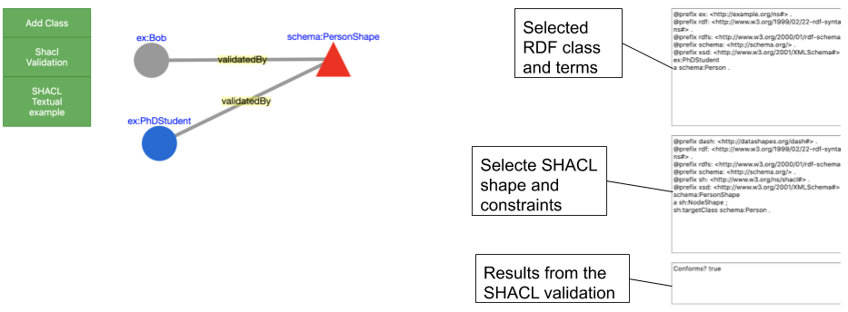

# shaclEditor
An integrated environment for Visualizing, Validate, and Versioning RDF graph

## Starting:
Execute this comand in your bash:
```
bash <(curl -s https://raw.githubusercontent.com/firmao/shaclEditor/master/InstallShaclEditor.sh)
```
after all, inside shaclEditor directory, open the index.html in your web-browser.
_______________________

A video with a minimal example [here](https://youtu.be/c_3CL3FqVlw), just a proof of concept of a very first stage of this project (now should be different).

An unfinished version of the manual is [here](https://docs.google.com/document/d/1nIH84Lys71Trthr5-oNZGwZgfwD6RbWXOZqAJ387evo/edit?usp=sharing)

## Basic 3 steps of the workflow

- 1 - Create Concepts/classes and properties
- 2 - Create Shacl shapes and relate to the concepts
- 3 - Create instances of the concepts/classes and check if the instances are valid with Shacl constraints 

## What you can do with this "Shacl RDF Editor"

- Create RDF classes and add properties and RDF terms.
- Create SHACL shapes and add constraints to validate the content in your RDF classes.
- Execute and see the results of your SHACL validation on your RDF classes and terms.
- Execute SPARQL queries over the graphs with [QUIT store](https://github.com/AKSW/QuitStore/) (In progress).
- Obtain versions of the RDF Knowledge Base, due to the use of the [QUIT store](https://github.com/AKSW/QuitStore/)(In progress).



- RDF classes are represented by circles and SHACL shapes are represented by triangles.
- The SHACL validation and the RDF representation are in the textAreas on the right side of the screen.

## Use cases:
As a motivation of our work, we describe two distinct scenarios where the proposed resource may be useful:

### Scenario 1: 
Given an RDF class called person, assuming that a person cannot die before his birthday and this person can only have one social security number.

The following questions are raised:
- How to validate if the birthDate and Death date are correct?
- How to validate if a person has only one social security number?
- How to do all this validation without know RDF or SHACL constraints?

In this case, an approach is needed to enable the user to create graphically RDF classes validating the data with SHACL shapes.
The best solution for this case was to create a Graphical User Interface (GUI) on the web, which allows the user to create RDF classes and terms and validating the data using SHACL constraints in a pervasive way.

### Scenario 2:
Given an RDF class with terms, the user, without knowledge in RDF or SHACL wants to validate the information.

The following will be needed:

- A GUI to load the RDF class.
- A GUI to add constraints to this RDF class.

### Scenario 3:
Given a visual representation of a class their constraints.

- How to generate an RDF representation of the class and the constraints?
- From the RDF, how to generate a visual representation of the RDF class and the SHACL constraints?

## Main differences with the state of the art:
- A GUI for non-RDF/SHACL users(see usability study).
- Create and Edit SHACL constraints and RDF classes and terms, totally online.
- The most simple technology, basically it's only HTML and javascript applied. Many IDE's could be used to load the project, such as IntelliJIDEA, VisualSutdioJS, etc... just clone and start coding, no dependencies, no frameworks, no complex databases etc...

More details on the paper. 


contact:
firmao@gmail.com
