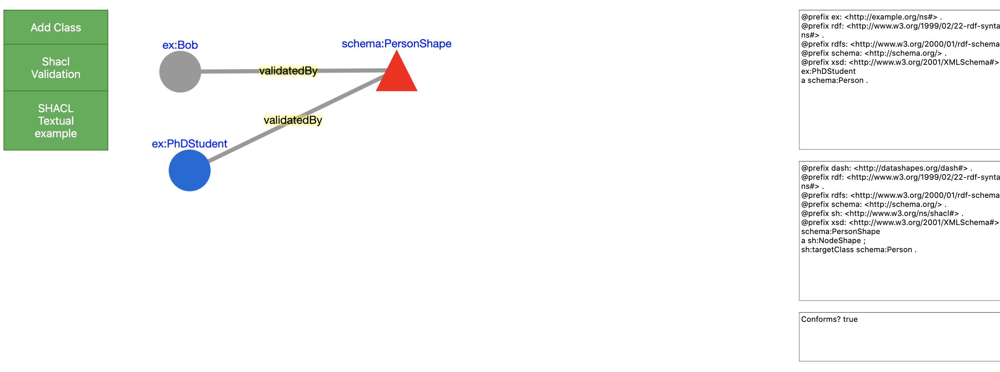

# shaclEditor
A GUI for RDF shacl validation

Video with a minimal example, just a proof of concept of a very first stage of this project.

https://www.youtube.com/watch?v=i958YCTpU2g

A demo is available (here)[http://141.57.11.86:8082/shaclgui/]:

1) Clone the repository;

2) Open the file (index.html)[https://github.com/firmao/shaclEditor/blob/master/index.html] in your webbrowser.

## What you can do with this "Shacl RDF Editor"

- Create RDF class and add properties and RDF terms.
- Create SHACL shape and add constraints to validate the content in your RDF classes.
- Execute and see the results of your SHACL validation on your RDF classes and terms.

